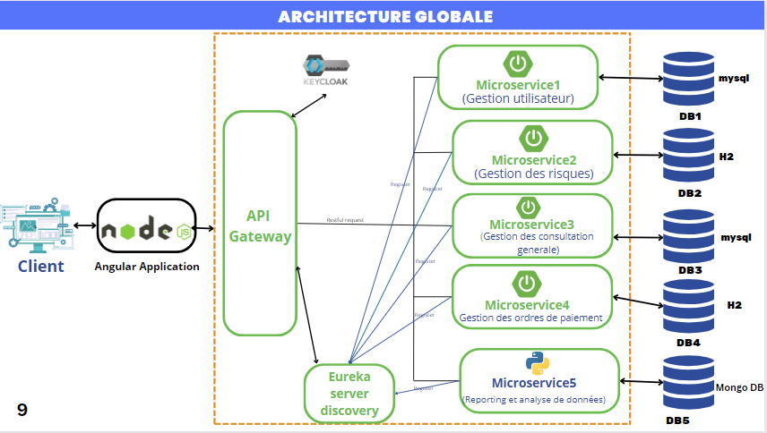

# Projet ArenaRecouvDist - Application de Recouvrement Bancaire Distribuée
Bienvenue dans le README du projet ArenaRecouvDist, une application de recouvrement bancaire développée dans le cadre d'un projet académique en équipe de cinq personnes. 
Notre objectif principal est de présenter une solution distribuée basée sur l'architecture de microservices à l'aide du framework Spring.
# Objectifs Principaux :
Architecture Distribuée : ArenaRecouvDist adopte une approche distribuée basée sur des microservices, permettant une gestion modulaire et évolutive des fonctionnalités.
# Technologies Utilisées :
- Spring boot , java , Spring microservice 
- Eureka Server 
- API Gateway
- Keycloack
- Database : MySql / H2 /MongoDB
# Architecture globale de l'application 
Notre application est subdivisée en :
- cinq microservices : dont quatre sont développés avec la technologie Spring et le dernier avec Python. Cette approche modulaire permet une gestion indépendante de chaque composant, favorisant la flexibilité et la maintenabilité de l'ensemble.
- Serveur de Découverte Eureka : joue un rôle essentiel en tant que registre central. Il permet à chaque microservice de s'enregistrer, facilitant ainsi la localisation et la communication entre eux. Eureka optimise la scalabilité et la résilience en assurant un suivi dynamique des instances de microservices disponibles.
- API Gateway : agit comme une porte d'entrée centrale pour l'ensemble du système. Il facilite la gestion du trafic, la sécurité, et l'exposition d'APIs vers l'extérieur.
- Keycloak :  joue un rôle crucial en assurant la gestion des identités et des accès. 
  

